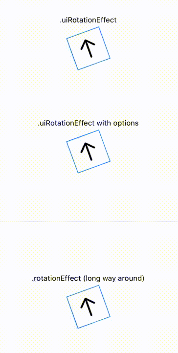

# UIRotationEffect

Credit: [@alonsoholmes](https://github.com/holmesal) for most of this solution.

## Explanation

As of iOS 13.5, SwiftUI's `rotationEffect` modifier takes the "long way around" when animating changes in rotation. For example, a rotation from 350° to 20° will cover 330° of rotation, even though those angles have only 30° of separation.

UIKit's animation libraries handle this situation correctly. This Swift Package is a simple wrapper, accessible by modifier, that adds this UIKit rotation behavior to your SwiftUI view.



## Installation
UIRotationEffect supports Swift Package Manager. Simply add this url in *XCode > File > Swift Packages > Add Package Dependency*:

```
https://github.com/DominicHolmes/UIRotationEffect
```

## Usage
Import `UIRotationEffect` into your project. Then use `.uiRotationEffect(angle)` wherever you would normally use `.rotationEffect(angle)`.

Because the animation is now handled by UIKit, you'll have to pass in additional options if you want to customize it. `uiRotationEffect` takes all the same options as [this method](https://developer.apple.com/documentation/uikit/uiview/1622451-animate). 

The full method signature is:
```
func uiRotationEffect(
    _ angle: Angle, 
    duration: TimeInterval? = nil, 
    delay: TimeInterval? = nil, 
    options: UIView.AnimationOptions? = nil, 
    completion: ((Bool) -> Void)? = nil
) -> some View
```

Example usage:
```
VStack {

    Text("UIRotation Effect")
        .font(.caption)

    Image(systemName: "arrow.up")
        .font(.largeTitle)
        .foregroundColor(.primary)
        .padding()
        .border(Color.blue)
        .uiRotationEffect(angle)
        .frame(width: 60, height: 60)

    Text("UIRotationEffect with options")
        .font(.caption)

    Image(systemName: "arrow.up")
        .font(.largeTitle)
        .foregroundColor(.primary)
        .padding()
        .border(Color.blue)
        .uiRotationEffect(angle, duration: 2.0, options: [.curveEaseInOut])
        .frame(width: 60, height: 60)

}
```

#### Known Issues (Ideas Welcome)
* Using this modifier with a very large (~1200x1200) SwiftUI view produces visual glitches.
* Explicit frames are required, otherwise the view takes up all available space.
